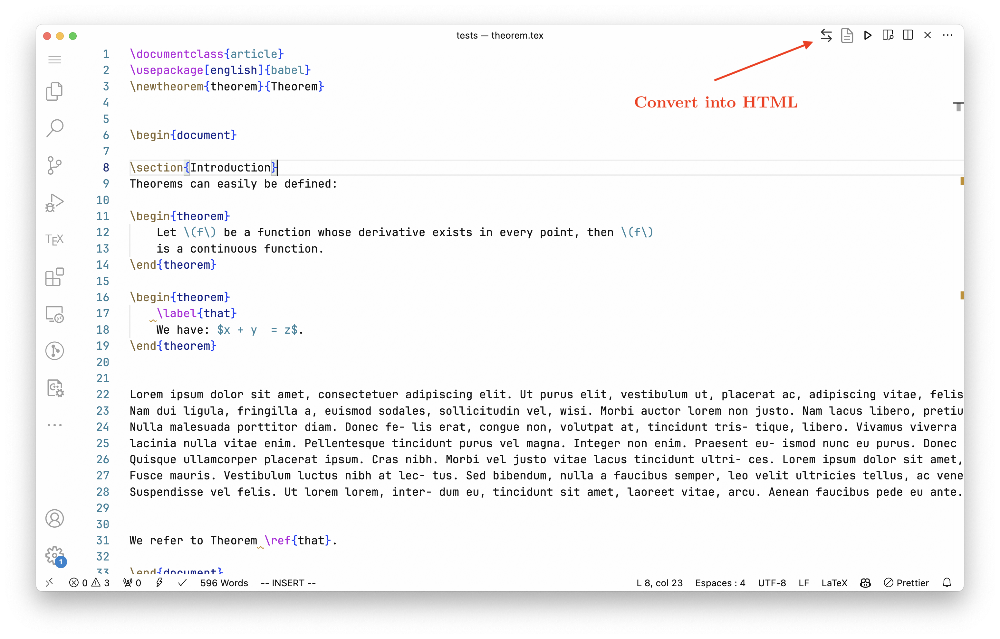
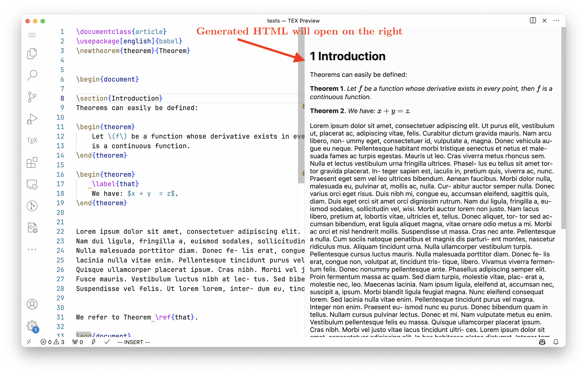
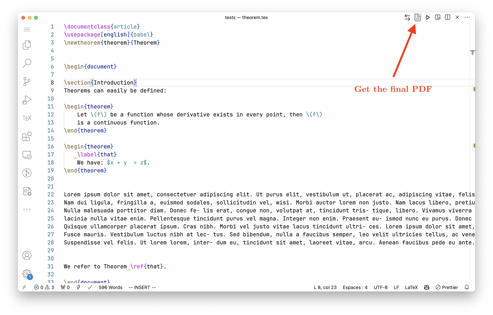

# **Instruction for use of the `tex2html` extension**

## Contact

If you have any question regarding the use of the tex2html, we can be
reached at <info@hackahealth.ch>

## Description

Our extension is a tool that allows you to convert your LaTeX document
into HTML, before generating PDFs. The goal is to allow visually
impaired people to get a more proofreadable document than the PDF. The
extension is available on the [VSCode
marketplace](https://marketplace.visualstudio.com/items?itemName=ATC.tex2html).

## Installation

*Note:* you must have `python`, `pandoc` and a LaTeX compiler installed on your machine. On Windows, you can simply follow the instructions of pop-up messages for installation. See `INSTALL.md` for more information.\

LaTeX compiler is only required to get the PDF. The default compiler is `pdflatex`, if you want to use another compiler, you can specify in the extension settings.

To install the extension, you have several option:

- Install it directly from the [VSCode
    marketplace](https://marketplace.visualstudio.com/items?itemName=ATC.tex2html)
    by clicking on the install button.

- From the VSCode editor, go to the extension tab, search for  `tex2html` and click on install.

- From the command line, you can run the following command:  `code –install-extension atc.tex2html`.

## Usage

### Convert to HTML

Convert a tex file to HTML: Open a `.tex` file and press `Ctrl+Shift+P` (`Cmd+Alt+P`) to open the command palette. Then, type `Convert to HTML` and press `Enter`. You can also hit `Ctrl+Alt+H` (`Cmd+Alt+H`) to convert the file to HTML. Alternatively, you can click on the button:

The HTML file will be generated in the same directory as the `.tex` file and will open in the right panel.

This document is accessible to visually impaired people and can be read by screen readers.

### Convert to PDF

Once proofreading is done, you can convert the HTML file to PDF. To do so, open the HTML file and press `Ctrl+Shift+P` (`Cmd+Alt+P`) to open the command palette. Then, type `Convert to PDF` and press `Enter`. You can also hit `Ctrl+Alt+P` (`Cmd+Alt+P`) to convert the file to PDF. Alternatively, you can click on the button:

The final PDF will be generated in the same directory as the HTML file and will be open in full screen mode.