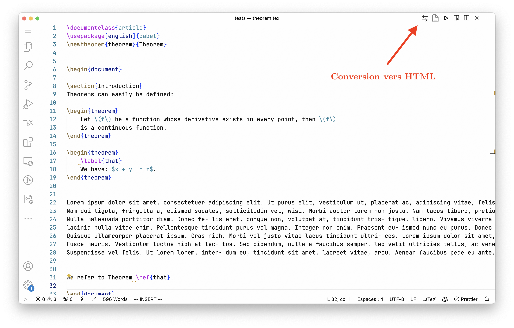
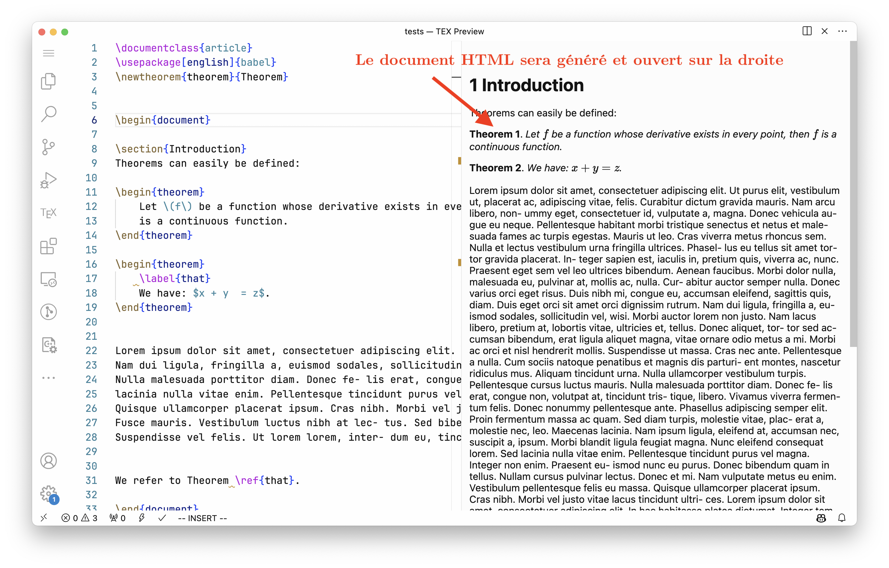
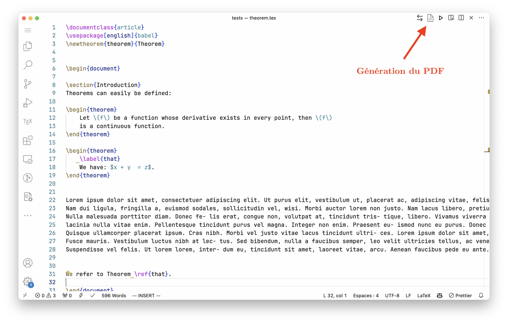

# **Instructions pour l'utilisation de l'extension `tex2html`**

## Contact

Si vous avez des questions concernant l'utilisation de `tex2html`, vous pouvez nous contacter à <info@hackahealth.ch>.

## Description

Notre extension est un outil qui vous permet de convertir votre document LaTeX en HTML, avant de générer des PDF. Le but est d'offrir aux personnes malvoyantes un document plus lisible que le PDF. L'extension est disponible sur le [marché VSCode](https://marketplace.visualstudio.com/items?itemName=ATC.tex2html).

## Installation

*Note:* Vous devez avoir `python`, `pandoc` et `pdflatex` installés sur votre machine. `pdflatex` n'est nécessaire que pour générer le PDF. Si vous souhaitez utiliser un autre compilateur, vous pouvez toujours compiler le PDF manuellement. Des options pour changer de compilateur seront disponibles ultérieurement.

Pour installer l'extension, plusieurs options s'offrent à vous :

- Installez-la directement depuis le [marché VSCode](https://marketplace.visualstudio.com/items?itemName=ATC.tex2html) en cliquant sur le bouton d'installation.

- Depuis l'éditeur VSCode, accédez à l'onglet des extensions, recherchez `tex2html` et cliquez sur installer.

- Depuis la ligne de commande, vous pouvez exécuter la commande suivante : `code –install-extension atc.tex2html`.

## Utilisation

### Convertir en HTML

Pour convertir un fichier tex en HTML, ouvrez un fichier `.tex` et appuyez sur `Ctrl+Shift+P` (`Cmd+Alt+P`) pour ouvrir la palette de commandes. Ensuite, tapez `Convert to HTML` et appuyez sur `Enter`. Vous pouvez également appuyer sur `Ctrl+Alt+H` (`Cmd+Alt+H`) pour convertir le fichier en HTML. Alternativement, vous pouvez cliquer sur le bouton :

Le fichier HTML sera généré dans le même répertoire que le fichier `.tex` et s'ouvrira dans le panneau de droite.

Ce document est accessible aux personnes malvoyantes et peut être lu par les lecteurs d'écran.

### Convertir en PDF

Une fois la relecture terminée, vous pouvez convertir le fichier HTML en PDF. Pour ce faire, ouvrez le fichier HTML et appuyez sur `Ctrl+Shift+P` (`Cmd+Alt+P`) pour ouvrir la palette de commandes. Ensuite, tapez `Convert to PDF` et appuyez sur `Enter`. Vous pouvez également appuyer sur `Ctrl+Alt+P` (`Cmd+Alt+P`) pour convertir le fichier en PDF. Alternativement, vous pouvez cliquer sur le bouton :

Le fichier PDF final sera généré dans le même répertoire que le fichier HTML et s'ouvrira en mode plein écran.